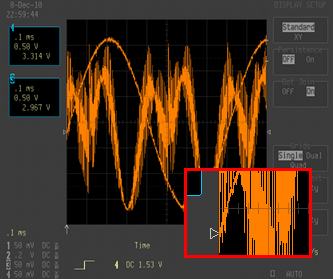

.. Lecroy Colorizer documentation master file, created by
   sphinx-quickstart on Sun Aug 05 15:33:06 2012.
   You can adapt this file completely to your liking, but it should at least
   contain the root `toctree` directive.

=====================
LeCroy 93xx Colorizer
=====================

.. toctree::
   :maxdepth: 1
   :hidden:

   settings

LeCroy Colorizer is a command line utility to add color to the black and white
images produced by the screen capture on the LeCroy 93xx series oscilloscopes.
It should run without issue on all platforms that support Python and PIL.

Features
--------
* Colorize all portions of a 93xx series screen capture
* Automatically detects grid layout
* Provides user customizable colors
* Supports a wide variety of input and output image formats

Requirements
------------
* Python 2.6 or newer. Not tested under Python 3 due to lack of PIL support
* `Python Imaging Library (PIL) <http://www.pythonware.com/products/pil>`_

The installation script depends on setuptools which will be installed if it isn't currently present in your Python distribution.

Download
--------
You can access the lecroy-colorizer Git repository from `Github <https://github.com/kevinpt/lecroy-colorizer>`_. `Packaged source code <https://drive.google.com/folderview?id=0B5jin2146-EXQ1pYOGpTSDF6NGs&usp=sharing>`_ is also available for download.

Installation
------------
For all platforms, installation via setup.py is provided. After extracting the compressed archive, run the following command:

.. parsed-literal::

  > python setup.py install

This will install the lecroy-colorizer distribution (and PIL if necessary) into
your Python's site-packages and create an executable link to the colorize_lecroy
script.

The LeCroy colorizer has been tested on Python 2.6 and 2.7 using native
Windows and the Cygwin environment. It should run without issues on any POSIX
platform. As of 2012/8/5 The PIL installed with Cygwin's Python 2.6
misbehaves slightly by printing "Aborted" when the program ends.
	
Using LeCroy Colorizer
----------------------
The simplest way to run the colorizer is to supply the input file name:

.. parsed-literal::

  > colorize_lecroy -i <input>

This will produce a color output image named ``color_<input>.png`` using the default color style.

=======================================  =======================================
Original                                 Colorized
=======================================  =======================================
.. image:: images/example_single.png     .. image:: images/color_single.png
=======================================  =======================================

If you want to control the output file name and format, specify it with the ``-o <output>`` switch.

You can use alternate predefined color styles or supply your own color definitions in a settings file passed with the ``-s`` switch:

.. parsed-literal::

  > colorize_lecroy -i captured_image.bmp -o colorized_image.png -s my_colors.cfg

See :doc:`settings` for more information on how to define your own styles.

The predefined color styles are:

=======================================  =======================================
93xx                                     analog
---------------------------------------  ---------------------------------------
.. image:: images/style_93xx.png         .. image:: images/style_analog.png
---------------------------------------  ---------------------------------------
gray                                     gray --hide=menu
---------------------------------------  ---------------------------------------
.. image:: images/style_gray.png         .. image:: images/style_gray_nomenu.png
---------------------------------------  ---------------------------------------
light                                     waverunner
---------------------------------------  ---------------------------------------
.. image:: images/style_light.png         .. image:: images/style_waverunner.png
=======================================  =======================================

Trace Reconstruction
~~~~~~~~~~~~~~~~~~~~
The black and white images produced by a screen dump on the scope don't
distinguish the grid lines and traces. By default the colorizer attempts to
reconstruct the portions of the traces that cross the grid lines. These can be
colored independently using the "Trace-Reconstruction" color. The
reconstruction is achieved through Boolean operations on the original image. It
is mostly accurate but can produce small artifacts. The ``-r`` option is used to
disable the reconstruction and show the grids overlaid on top of the traces.

Hiding regions
~~~~~~~~~~~~~~
The ``--hide`` option is used to supply a list of region names that will be hidden.
Multiple regions can be specified by separating them with a comma:

.. parsed-literal::

  > colorize_lecroy -i foo.bmp -s analog --hide=menu,time,trig-mode

Any region defined in a style file can be hidden. They are treated as case insensitive
names so it is not necessary to observe the same capitalization scheme. As special cases,
the ``menu`` and ``channels`` regions also cause the associated ``*``-text and ``*``-background regions to be hidden as well. The available regions are the same as those listed in the :ref:`region colors <region colors>` section.

Overriding colors
~~~~~~~~~~~~~~~~~
The ``--color`` option is used to supply a list of colors that will override those from the currently active style. This allows you to make color modifications without needing to create a new style definition. The argument is supplied as a comma separated list of ``<name>:<color>`` pairs where ``<name>`` is a defined region and ``<color>`` is one of the supported :ref:`color specifiers <colors>`.

Simulating a transparent grid overlay:

.. parsed-literal::

  > colorize_lecroy -i foo.bmp --color="grid:#333,trace:hsl(30,100%,50%),trace-reconstruction:hsl(30,80%,40%)"

Example
~~~~~~~

Consider that you want to prepare two screen captures for publication using the "light" style. To distinguish the images it would help to change the color of the traces. To remove visual clutter the menu and trigger mode will be hidden. Use the following to accomplish this goal:

.. parsed-literal::

  > colorize_lecroy -i wave1.bmp -s light --hide=menu,trig-mode
  > colorize_lecroy -i wave2.bmp -s light --hide=menu,trig-mode --color=trace:green,channels:green

=======================================  =======================================
.. image:: images/blue_trace.png         .. image:: images/green_trace.png
=======================================  =======================================

Capturing A Screen Image
------------------------
The 93xx series scopes provide a wide range of methods for saving data. The
only commonly available method on all scopes is to use the serial or GPIB
ports. With a suitable cable you can connect to the scope under Windows using
the `ScopeExplorer <http://www.lecroy.com/support/softwaredownload/scopeexplorer.aspx>`_
utility. On other platforms you will need to send the ``SCDP`` command and
process the data transmitted by by the scope.

If a floppy drive is installed and working it is another avenue for saving
images captured on the scope.

The front panel PCCard slot only handles SRAM cards which are not well
supported with modern operating systems. However, if you have the type-3 hard
drive option on the back, you can use a more modern CF card with an adapter to
capture data to flash memory.

To capture an image of the screen you need to select the desired output. Press
the "Utilities" button, then select "Hardcopy Setup". From there select an
output destination. If you are using GPIB or the serial port you will need to
configure parameters under "GPIB/RS232 Setup".

Once the output destination is set, you can capture an image by pressing the
"Screen Dump" button on the front panel.

Licensing
---------
This program is licensed for free commercial and non-commercial use under the terms of the MIT license.
